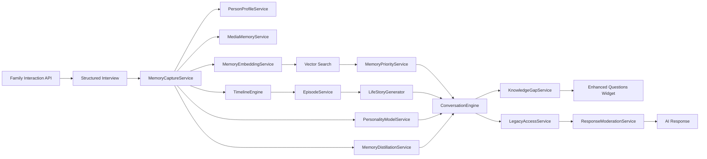

# Legacy AI Platform

Legacy AI is a platform designed to capture and preserve life experiences as structured memories, enabling family members to interact with an AI representation of their loved one after they pass away.

## Features

- **Life Experience Capture**: Guided structured interviews and free-form tools to record personal stories across all life domains.
- **Structured Memory Storage**: Memories stored with rich metadata — life stage, emotional tone, people, locations, timestamps, and temporal context (day of week, time of day, start/end time).
- **Media Memory Service**: Attach photos, audio recordings, and video clips to memory entries.
- **Timeline Engine**: Organize memories chronologically and by life stage (childhood, education, career, retirement).
- **Episodic Memory System**: Groups related memories into meaningful life episodes using shared tags and time-period proximity.
- **Semantic Search**: Vector embeddings enable natural-language queries to find the most relevant memories instantly.
- **Life Story Generator**: Compiles chronological biographical narratives with key events, themes, and personality evolution.
- **Conversation Engine**: Orchestrates memory retrieval and context building to generate personalized AI responses.
- **Memory Importance & Emotional Weighting**: Prioritizes retrieved memories using life importance, emotional intensity, and recency.
- **Knowledge Gap Detection**: Detects missing details during free-style storytelling and prepares follow-up prompts.
- **Enhanced Questions Widget Support**: Stores pending follow-up questions users can answer later to enrich memory records.
- **Person Profile System**: Tracks people mentioned in memories and conversations so the AI can reason about relationships over time.
- **Minimal Chat Interface**: Provides a simple frontend for asking questions, reviewing referenced memories, and resolving enhanced follow-up prompts.
- **Personality Modeling**: Analyzes memory patterns to build authentic personality profiles for realistic interactions.
- **Memory Distillation**: Extracts higher-level wisdom, life lessons, and guidance from raw memories.
- **Secure Posthumous Access**: Role-based access controls (guardian, spouse, child, extended family, friend) for designated beneficiaries.
- **Response Moderation**: Automatic filtering to ensure all AI responses remain respectful, safe, and appropriate.
- **Family Interaction API**: REST endpoints for querying memories, browsing timelines, and conversing with the AI persona.
- **Containerised Deployment**: Docker Compose setup with PostgreSQL and Qdrant vector database for one-command local deployment.
- **CI/CD Pipeline**: GitHub Actions runs black, ruff, mypy, and pytest across Python 3.9 / 3.10 / 3.11 on every push.

## Sample Memory Dataset

The repository includes a realistic seed dataset at `backend/data/sample_memories.json` with 50 memories spanning childhood, education, career, relationships, failures and lessons, and advice to children.

This dataset is used for testing and demos by letting integration tests seed the memory pipeline from JSON instead of only using the in-file fixture.

To enable dataset loading in the integration suite:

```bash
LEGACY_SAMPLE_MEMORIES_FILE=true pytest backend/tests/test_integration_pipeline.py -v
```

You can also point to a custom dataset path:

```bash
LEGACY_SAMPLE_MEMORIES_FILE=backend/data/sample_memories.json pytest backend/tests/test_integration_pipeline.py -v
```

## Memory Temporal Context

Memories now support richer temporal metadata in addition to the main timestamp:

- `time_of_day` (`morning`, `afternoon`, `evening`, `night`)
- `start_time` (`HH:MM`)
- `end_time` (`HH:MM`)
- `day_of_week`

This temporal context helps the Timeline Engine and Life Story Generator build more natural narratives, such as describing recurring morning routines, weekend family rituals, or evening milestones. It also improves response quality in conversational prompts where users ask when events typically happened.

## Episodic Memory System

The platform now includes an **EpisodeService** that groups related memories into higher-level episodes representing meaningful life periods or events.

Each episode stores:

- `episode_id`
- `title`
- `life_stage`
- `start_date`
- `end_date`
- `summary`
- `related_memories`
- `related_people`
- `importance_score`

Episode grouping works through two complementary paths:

- **MemoryCaptureService integration**: newly created or updated memories are evaluated for similarity and can be auto-linked into an existing or new episode.
- **TimelineEngine integration**: memories can be clustered into episodes when they share tags or occur within nearby time windows.

The **LifeStoryGenerator** consumes episodes and appends an "Episodic Highlights" section so narratives include both fine-grained memory details and larger life chapters.

## Memory Importance & Emotional Weighting

The platform now includes a **MemoryPriorityService** that ranks candidate memories before response generation.

For each memory, the service computes:

- `importance_score`: based on life milestones, major events, and high-signal tags like `family`, `career`, and `lesson`
- `emotional_weight`: based on attached emotions and inferred intensity
- `recency_factor`: a light preference toward more recent memories

Final ranking formula:

```text
priority_score =
    (importance_score * 0.6)
    + (emotional_weight * 0.3)
    + (recency_factor * 0.1)
```

The **ConversationEngine** applies this ranking after semantic retrieval so the highest-priority memories are used first when building response context.

## Enhanced Questions System

The AI now includes a Knowledge Gap Detection workflow that analyzes free-style storytelling for missing context without interrupting the user.

When the system detects missing information (for example, unknown people mentions, incomplete memories, or absent contextual details), it generates follow-up prompts and stores them for the **Enhanced Questions** widget.

Each stored question includes:

- `question_id`
- `question`
- `related_memory_id`
- `source_conversation_timestamp`
- `context_description`
- `priority`
- `status` (`pending` or `answered`)

When users answer these prompts, the system marks each question as answered and updates the related memory with the newly provided context, improving future narrative quality and response relevance.

## Person Profile System

The platform now maintains lightweight person profiles for individuals mentioned in memories and conversations.

These profiles let the AI track who someone is, how they relate to the user, where they first appeared, and which memories connect to them. Profiles can be partial when information is incomplete and grow richer as new details are learned from memory updates, conversation mentions, and answers to Enhanced Questions.

Each person profile can include:

- `person_id`
- `name`
- `relationship_to_user`
- `origin`
- `age`
- `marital_status`
- `children`
- `description`
- `connected_memories`
- `confidence_score`

When a new person is mentioned in conversation and no existing profile matches, the system creates a temporary profile so future questions and answers can attach to the same entity.

## Chat Interface

The frontend now includes a minimal chat interface for interacting with the Legacy AI backend.

Users can:

- send questions to the Family Interaction API `/ask` endpoint
- review the AI response alongside referenced memory IDs
- keep a visible conversation history in the browser
- see pending **Enhanced Questions** generated by the KnowledgeGapService
- answer those follow-up prompts directly from the UI to enrich stored knowledge

The React application lives under `frontend/src`, and a lightweight standalone version is also included at `frontend/app/chat_interface/`.

Example memory payload:

```json
{
    "id": "memory_042",
    "title": "Dinner date with your mom",
    "description": "...",
    "timestamp": "2012-06-15T21:00:00",
    "day_of_week": "Sunday",
    "time_of_day": "evening",
    "start_time": "21:00",
    "end_time": "23:45",
    "people_involved": ["mom"],
    "emotions": ["joy"],
    "tags": ["family"]
}
```

## System Pipeline

The Legacy AI platform follows a comprehensive data processing pipeline that transforms personal stories into meaningful AI interactions:

**Family Interaction API → Structured Interview → Memory Capture → Person Profile System → Media Memory Service → Timeline Engine → Episodic Memory System → Memory Embeddings → Vector Search → Memory Importance & Emotional Weighting → Life Story Generator → Conversation Engine → Knowledge Gap Detection → Enhanced Questions Widget → Personality Model → Memory Distillation → Legacy Access Control → Response Moderation → AI Response**

## System Architecture Diagram



### Pipeline Components

1. **Family Interaction API**: REST endpoints allowing beneficiaries to ask questions, browse memories, and explore timelines
2. **Structured Interview**: Guided question sets across life domains capture comprehensive personal experiences
3. **Memory Capture**: Converts interview responses and stories into structured memory entries with metadata
4. **Person Profile System**: Tracks people mentioned across memories and conversations, linking them into reusable entity profiles
5. **Media Memory Service**: Handles upload and management of multimedia memories (photos, audio, video) linked to memory entries
6. **Timeline Engine**: Organizes memories chronologically and by life stages for contextual understanding
7. **Episodic Memory System**: Groups related memories into meaningful episodes using shared tags and time proximity
8. **Memory Embeddings**: Transforms memory text into vector representations for semantic search
9. **Vector Search**: Finds semantically similar memories using cosine similarity and embedding matching
10. **Memory Importance & Emotional Weighting**: Reorders retrieved memories by combining importance, emotional intensity, and recency
11. **Life Story Generator**: Compiles chronological narratives from memories and episode summaries, creating cohesive life stories with key events and personality evolution
12. **Conversation Engine**: Orchestrates memory retrieval, context building, and response generation
13. **Knowledge Gap Detection**: Identifies unknown people, incomplete memory fields, and missing context during open storytelling
14. **Enhanced Questions Widget**: Displays pending follow-up prompts that users can answer asynchronously
15. **Personality Model**: Analyzes memory patterns to create authentic personality profiles for personalized responses
16. **Memory Distillation**: Extracts higher-level wisdom, life lessons, and guidance from raw memories
17. **Legacy Access Control**: Implements privacy and access controls for authorized beneficiaries
18. **Response Moderation**: Ensures all AI responses remain appropriate, respectful, and safe for family interactions
19. **AI Response**: Delivers personalized, contextually appropriate answers to user questions

### Data Flow Integration

- **Interview responses** automatically become **structured memories** with rich metadata, including temporal context for more natural storytelling
- **Person profile tracking** connects recurring people across memories so relationship questions remain grounded in consistent entities
- **Timeline context** enhances memory relevance by considering chronological relationships
- **Episode grouping** adds higher-level life chapters by clustering memories with common tags and time windows
- **Semantic embeddings** enable natural language queries to find relevant experiences
- **Memory priority ranking** promotes high-importance and emotionally significant memories before prompt construction
- **Vector store** persists embeddings locally as JSON (development) or in a scalable vector database (production)
- **Vector search** provides fast, accurate memory retrieval for conversational context
- **Memory distillation** transforms raw memories into actionable wisdom and life lessons
- **Conversation engine** synthesizes multiple memory sources into coherent, personalized responses
- **Knowledge gap detection** creates follow-up questions for the Enhanced Questions widget without interrupting active storytelling
- **Legacy access control** ensures privacy protection and authorized beneficiary access
- **Response moderation** filters and adjusts AI responses for safety and appropriateness

## Conversation Engine

The Conversation Engine is the core component that enables family members to interact with an AI representation of their loved one. It processes natural language queries and generates responses based on stored memories.

### Key Features

- **Semantic Memory Search**: Uses vector embeddings to find memories most relevant to user questions
- **Chronological Context**: Integrates timeline information to provide temporal context in responses
- **Distilled Wisdom Integration**: Incorporates life lessons, advice, and insights extracted from memories
- **Personality-Aware Responses**: Uses personality profiles for authentic, personalized interactions
- **Structured Response Format**: Returns responses with generated answers, memory references, insights used, and confidence scores
- **Future LLM Integration**: Designed for easy integration with OpenAI, local models, or Azure OpenAI

### API Interface

```python
# Initialize the conversation engine
conversation_engine = ConversationEngine(
    memory_service=memory_service,
    timeline_engine=timeline_engine,
    embedding_service=embedding_service
)

# Generate a response to a user query
response = conversation_engine.generate_response("What was your favorite family vacation?")

# Response structure
{
    'generated_answer': "I remember our trip to Hawaii in 2015...",
    'memories_used': ['mem_001', 'mem_045', 'mem_078'],
    'insights_used': ['Family vacations strengthen bonds', 'Taking time to relax is important'],
    'confidence_score': 0.87
}
```

### Workflow

1. **Semantic Search**: Finds top 5 most similar memories using vector embeddings
2. **Memory Retrieval**: Fetches full memory details for relevant memories
3. **Context Building**: Constructs chronological and thematic context from memories
4. **Insight Extraction**: Retrieves distilled wisdom and life lessons relevant to the query
5. **Prompt Construction**: Creates AI prompts with memory context, personality profile, and distilled insights
6. **Response Generation**: Generates conversational responses (currently placeholder)
7. **Confidence Calculation**: Computes response confidence based on similarity scores and insight quality

### Integration Points

- **MemoryCaptureService**: Retrieves stored memory objects
- **TimelineEngine**: Provides chronological organization and life stage grouping
- **MemoryEmbeddingService**: Performs semantic similarity search using vector embeddings
- **MemoryDistillationService**: Extracts wisdom, life lessons, and guidance from memories
- **PersonalityModelService**: Provides personality profiles for authentic responses

## Personality Modeling Engine

The Personality Modeling Engine analyzes stored memories to build comprehensive personality profiles that capture the authentic character, values, and behavioral patterns of the individual. This enables the Conversation Engine to generate responses that reflect the person's true personality.

### Key Features

- **Trait Analysis**: Identifies personality traits through keyword analysis and pattern recognition
- **Value Extraction**: Discovers core values and life principles from memory content
- **Communication Style Analysis**: Determines formality, emotional expression, and interaction patterns
- **Decision Pattern Recognition**: Identifies decision-making heuristics and approaches
- **Belief System Modeling**: Extracts core beliefs and philosophies from life experiences
- **Personality Evolution Tracking**: Analyzes how personality develops across life stages

### Personality Profile Structure

The engine generates structured personality profiles containing:

```python
@dataclass
class PersonalityProfile:
    traits: List[str]              # e.g., ['compassionate', 'adventurous', 'disciplined']
    core_beliefs: List[str]        # e.g., ['Family comes first', 'Honesty is crucial']
    communication_style: Dict      # formality, emotional_expression, directness
    values: List[str]              # e.g., ['family', 'integrity', 'achievement']
    decision_heuristics: List[str] # e.g., ['Makes decisions after careful consideration']
```

### API Interface

```python
# Initialize the personality modeling service
personality_service = PersonalityModelService(
    memory_service=memory_service,
    timeline_engine=timeline_engine,
    embedding_service=embedding_service
)

# Build a personality profile from all memories
profile = personality_service.build_personality_profile()

# Extract specific personality components
traits = personality_service.extract_traits(memories)
values = personality_service.extract_values(memories)
beliefs = personality_service.extract_core_beliefs(memories)
style = personality_service.extract_communication_style(memories)
patterns = personality_service.extract_decision_patterns(memories)

# Analyze personality evolution across life stages
evolution = personality_service.analyze_personality_evolution(memories)
```

### Integration with Conversation Engine

The Personality Modeling Engine seamlessly integrates with the Conversation Engine to provide personalized responses:

```python
# Create conversation engine with personality profile
conversation_engine = ConversationEngine(
    memory_service=memory_service,
    timeline_engine=timeline_engine,
    embedding_service=embedding_service,
    personality_profile=profile  # Enables personalized responses
)

# Generate personality-aware response
response = conversation_engine.generate_response("What do you think about taking risks?")
```

### Analysis Methods

- **Keyword Analysis**: Matches memory content against predefined trait and value dictionaries
- **Pattern Recognition**: Uses regex patterns to identify belief statements and decision patterns
- **Frequency Analysis**: Determines dominant traits based on occurrence frequency
- **Contextual Analysis**: Considers emotional metadata and relationship patterns
- **Temporal Analysis**: Tracks personality development across different life stages

### Future Enhancements

- **LLM Integration**: Use advanced language models for nuanced personality analysis
- **Semantic Clustering**: Group related personality indicators using embedding similarity
- **Cross-Memory Validation**: Ensure personality consistency across different memory types
- **Dynamic Profile Updates**: Adapt personality profiles as new memories are added

## Memory Distillation Engine

The Memory Distillation Engine analyzes stored memories to extract higher-level wisdom, life lessons, and guidance that transcend individual experiences. This enables the Conversation Engine to provide profound, insightful responses that reflect accumulated life wisdom rather than just surface-level memory recall.

### Key Features

- **Life Lesson Extraction**: Identifies valuable lessons learned from life experiences
- **Advice Generation**: Extracts practical advice and guidance from memory patterns
- **Pattern Recognition**: Discovers recurring themes and behavioral patterns across memories
- **Insight Categorization**: Organizes distilled wisdom by type (lessons, advice, regrets, principles)
- **Confidence Scoring**: Evaluates insight quality and reliability based on multiple factors
- **Personality Alignment**: Prioritizes insights that align with the individual's personality profile

### Distilled Insight Structure

The engine generates structured insights containing:

```python
@dataclass
class DistilledInsight:
    insight_type: str           # 'lesson', 'advice', 'regret', 'principle'
    insight_text: str           # The distilled wisdom text
    confidence_score: float     # 0-1 confidence in the insight
    source_memories: List[str]  # Memory IDs that contributed to this insight
    category: str              # Thematic category (e.g., 'family', 'career', 'relationships')
    emotional_intensity: float  # Emotional significance (0-1)
```

### API Interface

```python
# Initialize the memory distillation service
distillation_service = MemoryDistillationService(
    memory_service=memory_service,
    timeline_engine=timeline_engine,
    embedding_service=embedding_service,
    personality_profile=profile  # Optional for personality-aligned insights
)

# Extract different types of insights from memories
life_lessons = distillation_service.distill_life_lessons(memories)
advice = distillation_service.extract_advice(memories)
patterns = distillation_service.identify_recurring_patterns(memories)

# Categorize and organize insights
categorized_insights = distillation_service.categorize_insights(all_insights)

# Get insights relevant to a specific query
relevant_insights = distillation_service.get_relevant_insights("career advice", memories)
```

### Integration with Conversation Engine

The Memory Distillation Engine seamlessly integrates with the Conversation Engine to provide wisdom-based responses:

```python
# Create conversation engine with distillation service
conversation_engine = ConversationEngine(
    memory_service=memory_service,
    timeline_engine=timeline_engine,
    embedding_service=embedding_service,
    personality_profile=profile,
    distillation_service=distillation_service  # Enables wisdom-based responses
)

# Generate wisdom-enhanced response
response = conversation_engine.generate_response("What would you tell your younger self?")
# Response now includes distilled life lessons and advice
```

### Analysis Methods

- **Pattern Recognition**: Uses regex patterns to identify lesson statements, advice, and regrets
- **Frequency Analysis**: Determines insight importance based on occurrence across memories
- **Semantic Clustering**: Groups related insights using embedding similarity
- **Emotional Analysis**: Considers emotional metadata to gauge insight significance
- **Personality Alignment**: Filters insights to match the individual's personality profile
- **Confidence Scoring**: Multi-factor scoring based on keyword matches, emotional intensity, and source validation

### Future Enhancements

- **LLM Integration**: Use advanced language models for nuanced insight extraction and summarization
- **Cross-Memory Validation**: Ensure insight consistency across different memory types and time periods
- **Dynamic Insight Updates**: Adapt distilled wisdom as new memories are added
- **Multi-Language Support**: Extract insights from memories in different languages
- **Insight Evolution Tracking**: Analyze how wisdom develops and changes over time

## Life Story Generator

The Life Story Generator is a sophisticated narrative engine that transforms raw memories into cohesive, chronological life stories. It synthesizes data from the Timeline Engine, Personality Model, and Memory Distillation services to create a comprehensive biographical narrative that captures the essence of a person's life journey.

### Purpose and Capabilities

The Life Story Generator serves multiple purposes in the Legacy AI platform:

- **Biographical Preservation**: Creates a complete, readable life narrative from structured memories
- **Life Stage Analysis**: Provides stage-specific summaries (childhood, education, career, retirement)
- **Narrative Coherence**: Organizes events chronologically with thematic connections and transitions
- **Key Event Extraction**: Identifies and highlights significant life moments and milestones
- **Wisdom Integration**: Weaves lessons learned and distilled insights throughout the narrative
- **Personality Evolution**: Traces how personality developed and changed across different life stages

### Key Features

- **Chronological Compilation**: Transforms memories into a readable sequential narrative
- **Life Stage Summaries**: Generates focused narratives for each major life period
- **Key Event Identification**: Automatically identifies and prioritizes significant moments based on emotional intensity and milestone indicators
- **Thematic Analysis**: Extracts dominant themes and recurring patterns from memories
- **Personality Development Tracking**: Traces character growth and value evolution across stages
- **Lessons & Wisdom Integration**: Incorporates distilled insights and life lessons into the narrative
- **Multi-Level Narrative**: Provides both comprehensive full-life narratives and focused stage summaries

### Life Story Data Structure

```python
@dataclass
class LifeStory:
    user_id: str                                    # User identifier
    full_narrative: str                             # Complete chronological narrative
    life_stages: Dict[str, str]                     # Stage-specific summaries
    key_events: List[Dict[str, Any]]                # Extracted significant events
    lessons_learned: List[str]                      # Wisdom and insights from life
    personality_insights: Dict[str, Any]            # Personality evolution and traits
    memories_used: List[str]                        # IDs of memories included
    generation_timestamp: datetime                  # When the story was generated

@dataclass
class LifeStageSummary:
    stage_name: str                                 # e.g., 'childhood', 'career'
    age_range: tuple                                # Age range for the stage
    key_events: List[Dict[str, Any]]                # Important events in the stage
    dominant_themes: List[str]                      # Theme patterns within the stage
    personality_development: str                    # How personality evolved
    lessons_from_stage: List[str]                   # Stage-specific wisdom
    memory_count: int                               # Number of memories in stage
```

### API Interface

```python
# Initialize the Life Story Generator
life_story_generator = LifeStoryGenerator(
    memory_service=memory_service,
    timeline_engine=timeline_engine,
    personality_service=personality_service,
    distillation_service=distillation_service
)

# Generate a complete life story
life_story = life_story_generator.generate_life_story(user_id="user_123")

# Access the narrative components
print(life_story.full_narrative)           # Complete biography
print(life_story.life_stages)              # Stage summaries
print(life_story.key_events)               # Significant milestones
print(life_story.lessons_learned)          # Wisdom learned
print(life_story.personality_insights)     # Character development

# Generate a specific life stage summary
stage_summary = life_story_generator.generate_life_stage_summary("career")
print(stage_summary.key_events)            # Career stage milestones
print(stage_summary.dominant_themes)       # Themes during career
print(stage_summary.lessons_from_stage)    # Career-related lessons

# Compile custom narrative from specific memories
narrative = life_story_generator.compile_chronological_narrative(selected_memories)
```

### Workflow

1. **Memory Retrieval**: Gather all memories for the user
2. **Chronological Organization**: Sort memories by timestamp
3. **Life Stage Grouping**: Categorize memories into life stages based on age
4. **Key Event Extraction**: Identify significant events using emotional and milestone indicators
5. **Theme Analysis**: Identify dominant themes from tags, emotions, and locations
6. **Personality Tracing**: Analyze personality development within each stage
7. **Wisdom Integration**: Incorporate lessons from distillation service
8. **Narrative Compilation**: Create readable prose from structured data
9. **Story Assembly**: Combine all elements into LifeStory object

### Integration with Other Components

The Life Story Generator integrates seamlessly with multiple platform components:

```python
# Conversation Engine can reference the life story for context
response = conversation_engine.generate_response(
    user_query="Tell me about your career highlights",
    context=life_story  # Provides narrative context
)

# Access Control applies to narrative access
authorized_narrative = access_service.filter_life_story(
    life_story=life_story,
    beneficiary_id="beneficiary_456",
    access_level="LIMITED_ACCESS"
)

# Family Interaction API can serve life story endpoints
GET /api/v1/life-story/{user_id}          # Get full narrative
GET /api/v1/life-story/{user_id}/stages   # Get stage summaries
GET /api/v1/life-story/{user_id}/events   # Get key events
```

### Future Enhancements

- **LLM-Enhanced Narratives**: Integrate GPT-4 or similar models for sophisticated prose generation
- **Dialogue Synthesis**: Extract and include direct quotes from memory descriptions
- **Narrative Styles**: Support multiple narrative styles (formal biography, casual storytelling, poetic)
- **Thematic Threading**: Create semantic connections between related memories and themes
- **Multi-Media Narrative**: Embed photos, audio clips, and videos into the narrative
- **Collaborative Storytelling**: Allow family members to contribute to and refine the narrative
- **Emotional Arc Mapping**: Visualize emotional journey across lifespan
- **Comparative Narratives**: Generate variations highlighting different themes or perspectives

## Legacy Access Control System

The Legacy Access Control System implements comprehensive privacy and security measures for the Legacy AI platform, ensuring that sensitive memories and personal information are only accessible to authorized beneficiaries under appropriate conditions. This system provides graduated access levels based on relationship, trust, and memory sensitivity.

### Key Features

- **Beneficiary Management**: Register and manage authorized users with different relationship types
- **Access Level Control**: Three-tier access system (Restricted, Limited, Full) based on relationship and trust
- **Memory Sensitivity Classification**: Tag memories with sensitivity levels (public, personal, medical, financial, intimate)
- **Legacy Activation Control**: Post-mortem access activation with verification mechanisms
- **Privacy-First Design**: Default to restrictive access with explicit permission grants

### Access Levels

- **RESTRICTED_ACCESS**: Basic public information and general memories
- **LIMITED_ACCESS**: Personal but non-sensitive memories and information
- **FULL_ACCESS**: Complete access including medical, financial, and intimate memories

### Relationship-Based Access

The system automatically assigns access levels based on beneficiary relationships:

- **Children & Spouse**: FULL_ACCESS by default
- **Parents**: LIMITED_ACCESS (respecting generational boundaries)
- **Siblings**: LIMITED_ACCESS
- **Friends & Others**: RESTRICTED_ACCESS

### API Interface

```python
# Initialize the access control service
access_service = LegacyAccessService()

# Register beneficiaries
access_service.register_beneficiary("child_123", Relationship.CHILD)
access_service.register_beneficiary("sibling_456", Relationship.SIBLING)

# Activate legacy access (after verification)
access_service.verify_legacy_activation("deceased")

# Check memory access authorization
memory_metadata = MemoryMetadata(
    memory_id="mem_001",
    sensitivity_tags=["personal", "medical"],
    created_date="2024-01-15",
    is_legacy_active=True
)

can_access = access_service.authorize_memory_access("child_123", memory_metadata)
access_level = access_service.get_access_level("child_123")
```

### Integration with Conversation Engine

The Legacy Access Control System integrates seamlessly with the Conversation Engine to filter memories based on user permissions:

```python
# Create conversation engine with access control
conversation_engine = ConversationEngine(
    memory_service=memory_service,
    timeline_engine=timeline_engine,
    embedding_service=embedding_service,
    personality_profile=profile,
    distillation_service=distillation_service,
    access_service=access_service  # Enables privacy protection
)

# Generate response with access filtering
response = conversation_engine.generate_response(
    "Tell me about your medical history",
    user_id="child_123"  # Access control applied
)

# Response includes access_denied flag if some memories were filtered
print(response['access_denied'])  # True if access was restricted
```

### Security Architecture

- **Multi-Factor Authorization**: Combines relationship, access level, and memory sensitivity
- **Audit Trail**: Logs all access attempts for compliance and security monitoring
- **Graceful Degradation**: System continues to function with partial access restrictions
- **Future Legal Integration**: Designed for integration with death certificates and legal verification services

### Future Enhancements

- **Legal Verification Integration**: Connect with government death registries and legal executor systems
- **Multi-Party Approval**: Require multiple beneficiaries for highly sensitive access
- **Time-Based Access**: Graduated access over time after legacy activation
- **Digital Estate Management**: Integration with broader digital estate planning platforms
- **Audit & Compliance**: Comprehensive logging for legal and regulatory requirements

## Response Moderation Service

The Response Moderation Service acts as a critical safety layer that reviews all AI-generated responses before they are returned to users. The Legacy AI platform deals with deeply personal and emotional content, making content moderation essential for maintaining trust, safety, and appropriateness.

### Key Features

- **Content Analysis**: Detects sensitive topics including violence, illegal activities, explicit content, and self-harm
- **Keyword Filtering**: Uses comprehensive keyword lists to identify inappropriate content
- **Pattern Recognition**: Employs regex patterns to detect harmful instructions and dangerous content
- **Safe Response Generation**: Automatically replaces inappropriate responses with safe alternatives
- **Emotional Intensity Monitoring**: Flags responses with excessive negative emotional language
- **Multi-Level Sensitivity Classification**: Categorizes content as safe, sensitive, inappropriate, or harmful

### Content Categories Monitored

- **Violence**: Physical harm, death, abuse, and related topics
- **Illegal Activity**: Crime, drugs, fraud, and unlawful behavior
- **Explicit Content**: Sexual topics, nudity, and inappropriate intimacy
- **Self-Harm**: Suicide, self-injury, and mental health crises
- **Hate Speech**: Discrimination, prejudice, and offensive language
- **Medical/Financial Sensitive**: Private health and money matters
- **Harmful Instructions**: Dangerous how-to content and illegal guidance

### API Interface

```python
# Initialize the response moderation service
moderation_service = ResponseModerationService()

# Review a response for appropriateness
review_result = moderation_service.review_response("Response text here")
# Returns: {'is_safe': bool, 'sensitivity_level': ContentSensitivity, 'issues_found': [...], 'recommended_action': str}

# Automatically adjust response if needed (primary method for ConversationEngine)
safe_response = moderation_service.adjust_response_if_needed("Potentially inappropriate response")
# Returns: Original response if safe, or safe alternative if inappropriate

# Detect sensitive content details
content_analysis = moderation_service.detect_sensitive_content("Response text")
# Returns: Detailed analysis of detected issues and severity levels
```

### Integration with Conversation Engine

The Response Moderation Service integrates seamlessly with the Conversation Engine to ensure all responses are safe:

```python
# Create conversation engine with response moderation
conversation_engine = ConversationEngine(
    memory_service=memory_service,
    timeline_engine=timeline_engine,
    embedding_service=embedding_service,
    personality_profile=profile,
    distillation_service=distillation_service,
    access_service=access_service,
    moderation_service=moderation_service  # Enables response safety
)

# Generate moderated response
response = conversation_engine.generate_response("Tell me about that violent incident")

# Response includes moderation metadata
print(response['moderation']['is_safe'])  # True if response passed moderation
print(response['generated_answer'])  # Safe response if original was inappropriate
```

### Moderation Architecture

- **Rule-Based Filtering**: Current implementation uses keyword detection and pattern matching
- **Severity Classification**: Issues are categorized by severity (low, medium, high)
- **Action Recommendations**: Suggests allow, modify, or block based on content analysis
- **Safe Response Templates**: Pre-written alternatives for different inappropriate content types
- **Context Preservation**: Maintains conversational flow while ensuring safety

### Future Enhancements

- **AI-Powered Moderation**: Integration with OpenAI Moderation API, Google Perspective API
- **Machine Learning Models**: Custom fine-tuned models for nuanced content analysis
- **Multi-Language Support**: Content moderation for responses in different languages
- **User Feedback Integration**: Learning from user reports to improve detection
- **Contextual Analysis**: Understanding intent and context beyond keyword matching
- **Real-Time Updates**: Dynamic keyword lists and pattern updates

## Vector Memory Storage

The vector memory storage subsystem is responsible for persisting and searching the numerical embedding representations of every memory entry. It is implemented across two files:

- [`backend/app/services/memory/vector_store.py`](backend/app/services/memory/vector_store.py) — low-level storage and cosine-similarity search
- [`backend/app/services/memory/memory_embedding_service.py`](backend/app/services/memory/memory_embedding_service.py) — embedding generation and the public API consumed by the Conversation Engine

### How Embeddings Are Generated

`MemoryEmbeddingService` converts memory text into a fixed-length numerical vector:

```python
# Current placeholder — seeds random.uniform with hash(text) for repeatable output
EMBEDDING_DIMENSION = 384   # matches common BERT-style model output size

def generate_embedding(self, text: str) -> List[float]:
    random.seed(hash(text))
    return [random.uniform(-1, 1) for _ in range(self.EMBEDDING_DIMENSION)]
```

The 384-dimension size mirrors the output of lightweight sentence-transformer models (e.g. `all-MiniLM-L6-v2`) so the interface requires no changes when the placeholder is replaced with a real model.

When a memory is saved, the caller invokes:

```python
embedding_service.store_memory_embedding(memory_id, title + " " + description)
```

This generates the vector and delegates storage to `VectorStore`.

### How Embeddings Are Stored (Current — JSON)

`VectorStore` keeps all vectors in a Python `dict` that is flushed to a JSON file on every write:

```
memory_embeddings.json
{
  "mem_001": [0.12, -0.47, 0.83, ...],   // 384 floats
  "mem_002": [0.05,  0.91, -0.34, ...],
  ...
}
```

**Operation summary**

| Operation | Method | Description |
|---|---|---|
| Add | `add_embedding(id, vector)` | Stores vector, flushes JSON to disk |
| Search | `search(query_vector, top_k=5)` | Brute-force cosine similarity across all stored vectors |
| Update | `add_embedding(id, vector)` | Overwrites by key, flushes JSON |
| Delete | `remove_embedding(id)` | Removes key, flushes JSON |
| Retrieve | `get_embedding(id)` | Returns vector by ID |

The brute-force cosine scan is suitable for development and small datasets (< ~10 000 memories). For larger corpora the vector store should be swapped for an indexed solution (see below).

### Cosine Similarity Search

Similarity between the query vector $\mathbf{q}$ and each stored vector $\mathbf{v}$ is computed as:

$$\text{sim}(\mathbf{q}, \mathbf{v}) = \frac{\mathbf{q} \cdot \mathbf{v}}{\|\mathbf{q}\| \cdot \|\mathbf{v}\|}$$

All stored vectors are scored, sorted descending, and the top-$k$ results are returned with their scores. The Conversation Engine uses the top-5 results by default.

### Production Vector Storage Options

The `VectorStore` class is intentionally thin — replacing it requires only updating `MemoryEmbeddingService.__init__` to construct a different backend while keeping the `add_embedding`, `search`, `remove_embedding`, and `get_embedding` interface unchanged.

#### pgvector (PostgreSQL extension)

```python
# psycopg2 + pgvector extension
import psycopg2
from pgvector.psycopg2 import register_vector

conn = psycopg2.connect(DATABASE_URL)
register_vector(conn)

# Store
cur.execute("INSERT INTO memory_embeddings (id, embedding) VALUES (%s, %s)",
            (memory_id, embedding))

# Search (IVFFlat index for approximate nearest-neighbour)
cur.execute("""
    SELECT id, 1 - (embedding <=> %s::vector) AS score
    FROM memory_embeddings
    ORDER BY embedding <=> %s::vector
    LIMIT %s
""", (embedding, embedding, top_k))
```

**Best for**: teams already running PostgreSQL (the project's `docker-compose.yml` includes a PostgreSQL 15 container). No additional infrastructure needed — install the `pgvector` extension and add an `IVFFlat` or `HNSW` index for fast approximate search.

#### Pinecone (managed cloud)

```python
from pinecone import Pinecone

pc = Pinecone(api_key=PINECONE_API_KEY)
index = pc.Index("legacyai-memories")

# Store
index.upsert(vectors=[(memory_id, embedding, {"user_id": user_id})])

# Search with metadata filter
results = index.query(vector=query_embedding, top_k=5,
                      filter={"user_id": {"$eq": user_id}})
```

**Best for**: serverless or cloud-native deployments where operational simplicity matters. Supports metadata filtering, namespace isolation per user, and scales to billions of vectors without self-managed infrastructure.

#### Weaviate (open-source / cloud)

```python
import weaviate

client = weaviate.connect_to_local()  # or weaviate.connect_to_wcs()
collection = client.collections.get("Memory")

# Store
collection.data.insert({"memory_id": memory_id, "user_id": user_id},
                        vector=embedding)

# Search
result = collection.query.near_vector(near_vector=query_embedding, limit=5)
```

**Best for**: projects that want GraphQL-style queries, built-in multi-tenancy, and hybrid (keyword + vector) search. Can be self-hosted (add a `weaviate` service to `docker-compose.yml`) or used as a managed cloud service.

### Comparison Matrix

| Feature | JSON (current) | pgvector | Pinecone | Weaviate |
|---|---|---|---|---|
| Infrastructure | None | PostgreSQL | Managed SaaS | Self-hosted / SaaS |
| Max practical scale | ~10 k vectors | ~10 M vectors | Billions | ~100 M vectors |
| ANN index | No (brute force) | IVFFlat / HNSW | Managed | HNSW |
| Metadata filtering | No | SQL `WHERE` | Yes | Yes |
| Multi-tenancy | No | Schema-level | Namespaces | Native |
| Existing infra overlap | — | Reuses Postgres container | None | Add new container |
| Migration effort | — | Low | Medium | Medium |

### How MemoryEmbeddingService Integrates

`MemoryEmbeddingService` is the only component that talks to `VectorStore`. All other services go through `MemoryEmbeddingService`:

```
MemoryCaptureService  ──store──►  MemoryEmbeddingService  ──add_embedding──►  VectorStore / backend DB
                                                          ◄──search────────
ConversationEngine    ──query──►  MemoryEmbeddingService
```

To swap in a production backend:

1. Implement a new class (e.g. `PgVectorStore`) with the same four methods as `VectorStore`.
2. Replace `self.vector_store = VectorStore(...)` in `MemoryEmbeddingService.__init__` with the new class.
3. Replace `generate_embedding` with a real model call (OpenAI `text-embedding-3-small` or `sentence-transformers`).
4. No other files need to change.

### Replacing the Placeholder Embedding Model

For real semantic search, replace the random-vector placeholder with one of:

```python
# Option A — OpenAI (API key required)
from openai import OpenAI
client = OpenAI()
def generate_embedding(self, text: str) -> List[float]:
    return client.embeddings.create(
        input=text, model="text-embedding-3-small"
    ).data[0].embedding  # 1 536-dim

# Option B — sentence-transformers (fully local, no API key)
from sentence_transformers import SentenceTransformer
_model = SentenceTransformer("all-MiniLM-L6-v2")
def generate_embedding(self, text: str) -> List[float]:
    return _model.encode(text).tolist()  # 384-dim — matches EMBEDDING_DIMENSION
```

Option B requires no external service and keeps `EMBEDDING_DIMENSION = 384` unchanged, making it the lowest-friction upgrade path.

## Upcoming Components

The following systems are planned for future development to enhance the Legacy AI platform:

- **Advanced NLP Processing**: Enhanced entity extraction and sentiment analysis for richer memory metadata
- **Multi-modal Memory Support**: Support for images, audio, and video memories alongside text
- **Collaborative Memory Curation**: Tools for family members to collaboratively review and enhance memories
- **AI-Powered Interview Adaptation**: Dynamic question generation based on previous responses and personality insights

## Testing

The Legacy AI platform has two testing layers: **unit tests** that verify individual services in isolation, and **integration tests** that exercise the complete AI reasoning pipeline end-to-end. Both layers log human-readable summaries to `tests.log`.

### Test Logging System

All unit tests generate human-readable summaries in `tests.log` located in the repository root. This log helps monitor AI system behavior and provides detailed test results for analysis.

#### Log Format

Each test entry includes:
- **Test Name**: Identifier for the test method
- **Timestamp**: When the test was executed
- **Input Parameters**: Parameters used in the test
- **Expected Result**: What the test expected
- **Actual Result**: What was actually returned
- **Status**: PASS or FAIL

Example log entry:
```
TEST: LegacyAccessService authorization
Timestamp: 2026-03-16 14:30:25
Input: user_role=child, memory_tag=sensitive
Expected: restricted
Actual: restricted
Status: PASS
---
```

#### Benefits of Test Logging

The `tests.log` file serves several important purposes:

1. **Behavior Monitoring**: Track how the AI system responds to different inputs over time
2. **Regression Detection**: Identify when system behavior changes unexpectedly
3. **Debugging Support**: Detailed input/output information for troubleshooting
4. **Compliance Verification**: Ensure AI responses meet safety and appropriateness standards
5. **Audit Trail**: Maintain a record of system testing for quality assurance

### Running Tests

```bash
# Run all tests with pytest (recommended)
python3 -m pytest backend/tests/ -v

# Run only unit tests
python3 -m pytest backend/tests/ -v --ignore=backend/tests/test_integration_pipeline.py

# Run only integration tests
python3 -m pytest backend/tests/test_integration_pipeline.py -v

# View recent test log entries
tail -60 tests.log
```

### Test Coverage

#### Integration Tests (`test_integration_pipeline.py`)

The integration test suite verifies the full end-to-end reasoning pipeline — the same path taken by a request to the `/api/v1/ask` endpoint:

```
Query → ConversationEngine
       ├── MemoryEmbeddingService  (semantic search)
       ├── MemoryCaptureService    (full memory retrieval)
    ├── PersonProfileService    (entity profiles)
       ├── TimelineEngine          (chronological context)
    ├── KnowledgeGapService     (follow-up questions)
       ├── PersonalityModelService (personality profile)
       ├── MemoryDistillationService (distilled wisdom)
       ├── LegacyAccessService     (access control)
       └── ResponseModerationService (safety review)
              ↓
          AskResponse { generated_answer, memories_used,
                    insights_used, confidence_score,
                    access_denied, moderation }
```

| Test | What it verifies |
|---|---|
| `test_ask_returns_required_response_keys` | Response always contains all mandatory keys with correct types |
| `test_memories_used_references_seeded_memory_ids` | `memories_used` IDs are a subset of stored memory IDs |
| `test_confidence_score_within_valid_range` | `confidence_score` is a float in `[0.0, 1.0]` |
| `test_pipeline_with_personality_model_integration` | `PersonalityModelService` builds a profile without breaking the pipeline |
| `test_pipeline_with_memory_distillation_integration` | `MemoryDistillationService` populates `insights_used` |
| `test_moderation_does_not_block_safe_response` | `ResponseModerationService` passes ordinary memory responses |
| `test_authorised_beneficiary_can_retrieve_public_memories` | Child beneficiary can access memories — `access_denied` is False |
| `test_pipeline_handles_empty_memory_store_gracefully` | Empty store returns valid response with `memories_used = []` |
| `test_timeline_engine_provides_chronological_context` | `TimelineEngine` returns memories in ascending timestamp order |
| `test_full_stack_all_services_active` | All six optional services active simultaneously — full contract satisfied |

#### Unit Tests

| Test File | Service | Tests |
|---|---|---|
| `test_memory_capture_service.py` | MemoryCaptureService | 6 |
| `test_person_profile_service.py` | PersonProfileService (+ memory/conversation entity sync) | 5 |
| `test_episode_service.py` | EpisodeService (+ memory/timeline/life-story integration) | 6 |
| `test_memory_priority_service.py` | MemoryPriorityService (+ ConversationEngine ranking integration) | 4 |
| `test_timeline_engine.py` | TimelineEngine | 5 |
| `test_life_story_generator.py` | LifeStoryGenerator | 6 |
| `test_knowledge_gap_service.py` | KnowledgeGapService (+ ConversationEngine trigger path) | 4 |
| `test_legacy_access_service.py` | LegacyAccessService | 4 |
| `test_response_moderation_service.py` | ResponseModerationService | 12 |

**Total: 63 tests** (52 unit + 10 integration + 1 placeholder)

### Running Tests with Make

```bash
make test        # Run all 63 tests with verbose output (uses pytest)
make test-cov    # Run all tests with line-level coverage report
```

## Code Quality and Testing

The Legacy AI platform maintains high code quality standards through automated linting, formatting, and type checking integrated into the development workflow.

### Code Quality Tools

The project uses the following tools for code quality:

- **Black**: Opinionated code formatter ensuring consistent code style
- **Ruff**: Fast Python linter for code quality issues
- **MyPy**: Static type checker for catching type-related errors
- **Pytest**: Modern testing framework with comprehensive test discovery

### Running Code Quality Checks Locally

The `Makefile` provides shortcuts for all common development tasks:

```bash
# Install all dependencies
make install

# Format code (writes changes)
make format

# Check formatting without writing (CI mode)
make format-check

# Run mypy type checks
make type-check

# Run all tests
make test

# Run tests with coverage
make test-cov

# Run all quality gates (format-check + type-check + tests)
make quality
```

### Continuous Integration Pipeline

The project uses GitHub Actions for automated CI/CD. The workflow (`.github/workflows/ci.yml`) runs on every push and pull request to:

1. **Install Dependencies**: Set up Python environment with all required packages
2. **Run Linting**: Check code quality with ruff
3. **Check Formatting**: Verify code follows black style guide
4. **Type Checking**: Validate type annotations with mypy
5. **Run Tests**: Execute all tests with pytest
6. **Test Coverage**: Multiple Python versions (3.9, 3.10, 3.11) tested in parallel

#### CI Configuration

Tests run against:
- Python 3.9, 3.10, and 3.11
- Linux environment (Ubuntu Latest)
- All commits to main and develop branches
- All pull requests regardless of target branch

#### Workflow Status

Each pull request will show the CI pipeline status. All checks must pass before merging to main branch.

### Configuration

Code quality tool configurations are defined in `pyproject.toml`:

- **black**: Line length set to 100, targets Python 3.9+
- **ruff**: Checks for common errors, imports, and best practices
- **mypy**: Strict type checking with optional import handling
- **pytest**: Configured to discover tests in backend/tests directory

## Project Structure

### Directory Tree

```
.
|-- .env.example
|-- .github
|   `-- workflows
|       `-- ci.yml
|-- .gitignore
|-- .pre-commit-config.yaml
|-- CONTRIBUTING.md
|-- LICENSE
|-- Makefile
|-- README.md
|-- docker-compose.yml
|-- pyproject.toml
|-- ai
|   |-- data
|   |   `-- README.md
|   |-- models
|   |   `-- README.md
|   `-- scripts
|       `-- placeholder.py
|-- backend
|   |-- .dockerignore
|   |-- Dockerfile
|   |-- data
|   |   `-- sample_memories.json
|   |-- app
|   |   |-- __init__.py
|   |   |-- main.py
|   |   |-- api
|   |   |   |-- __init__.py
|   |   |   `-- family_interaction_api.py
|   |   |-- models
|   |   |   `-- __init__.py
|   |   `-- services
|   |       |-- __init__.py
|   |       |-- memory_capture_service.py
|   |       |-- timeline_engine.py
|   |       |-- ai
|   |       |   |-- __init__.py
|   |       |   |-- conversation_engine.py
|   |       |   |-- knowledge_gap_service.py
|   |       |   |-- life_story_generator.py
|   |       |   |-- memory_priority_service.py
|   |       |   |-- memory_distillation_service.py
|   |       |   `-- personality_model_service.py
|   |       |-- episode
|   |       |   |-- __init__.py
|   |       |   `-- episode_service.py
|   |       |-- entity
|   |       |   |-- __init__.py
|   |       |   `-- person_profile_service.py
|   |       |-- interview
|   |       |   |-- __init__.py
|   |       |   `-- structured_interview_service.py
|   |       |-- media
|   |       |   |-- __init__.py
|   |       |   `-- media_memory_service.py
|   |       |-- memory
|   |       |   |-- __init__.py
|   |       |   |-- memory_embedding_service.py
|   |       |   `-- vector_store.py
|   |       `-- security
|   |           |-- __init__.py
|   |           |-- legacy_access_service.py
|   |           `-- response_moderation_service.py
|   |-- config
|   |   `-- __init__.py
|   |-- tests
|   |   |-- __init__.py
|   |   |-- test_integration_pipeline.py
|   |   |-- test_knowledge_gap_service.py
|   |   |-- test_legacy_access_service.py
|   |   |-- test_life_story_generator.py
|   |   |-- test_memory_capture_service.py
|   |   |-- test_memory_priority_service.py
|   |   |-- test_episode_service.py
|   |   |-- test_person_profile_service.py
|   |   |-- test_placeholder.py
|   |   |-- test_response_moderation_service.py
|   |   |-- test_timeline_engine.py
|   |   `-- utils
|   |       |-- __init__.py
|   |       `-- test_logger.py
|   |-- app.py
|   `-- requirements.txt
|-- data
|   |-- memories
|   |   `-- README.md
|   `-- users
|       `-- README.md
|-- docs
|   `-- README.md
|-- frontend
|   |-- app
|   |   `-- chat_interface
|   |       |-- index.html
|   |       |-- standalone.js
|   |       `-- styles.css
|   |-- package.json
|   |-- public
|   |   `-- index.html
|   |-- src
|   |   |-- App.css
|   |   |-- App.js
|   |   |-- components
|   |   |   `-- index.js
|   |   |-- index.js
|   |   |-- pages
|   |   |   `-- index.js
|   |   `-- services
|   |       `-- index.js
|   `-- tests
|       `-- App.test.js
|-- scripts
|   `-- README.md
`-- tests
    `-- test_placeholder.py
```

### Detailed Explanations

#### Root Level
- **.env.example**: Template environment variables — copy to `.env` and fill in values before running locally.
- **.github/workflows/ci.yml**: GitHub Actions CI pipeline — runs black, ruff, mypy, and pytest on Python 3.9/3.10/3.11.
- **.gitignore**: Standard Python + Node.js + Docker ignore rules.
- **.pre-commit-config.yaml**: Pre-commit hooks — auto-runs black and ruff on staged Python files before each commit.
- **CONTRIBUTING.md**: Contributor guide — dev setup, code standards, branching strategy, and PR process.
- **LICENSE**: MIT License.
- **Makefile**: Developer shortcuts (`make test`, `make lint`, `make format`, `make build`, `make up`, `make down`, etc.).
- **pyproject.toml**: Tool configuration for black (line-length=100), ruff (E/W/F/I/C/B rules), mypy (strict), and pytest (testpaths=backend/tests).
- **docker-compose.yml**: Orchestrates backend + PostgreSQL 15 + Qdrant vector database for one-command local deployment.

#### ai/
AI-related components and resources.
- **data/README.md**: Placeholder for AI training data directory. Explains the purpose and ensures the folder is tracked in Git.
- **models/README.md**: Placeholder for trained AI models. Includes notes on storing model artifacts and checkpoints.
- **scripts/placeholder.py**: Sample Python script for AI workflows, such as data preprocessing or model training.

#### backend/
Backend server code using Flask.
- **app.py**: Main Flask application file with routes for login, memories, and database setup.
- **requirements.txt**: Python dependencies for the backend.
- **app/api/__init__.py**: API endpoints module. Contains a sample health check route and setup for additional Blueprints.
- **app/api/family_interaction_api.py**: Family interaction API using FastAPI. Provides REST endpoints for asking questions to Legacy AI (`/ask`), browsing memories (`/memories`), exploring timelines (`/timeline`), listing pending enhanced questions, answering follow-up prompts, and running health checks. Integrates with ConversationEngine, KnowledgeGapService, LegacyAccessService, and ResponseModerationService for secure, moderated AI interactions.
- **app/models/__init__.py**: Data models module. Placeholder for SQLAlchemy models like User and Memory.
- **app/services/__init__.py**: Business logic services. Includes a sample service function for shared logic.
- **app/services/ai/__init__.py**: Package initializer for AI services, exporting conversation, personality, distillation, life story, and knowledge gap services.
- **app/services/ai/conversation_engine.py**: Conversation engine for AI-powered interactions. Integrates memory capture, person profiles, timeline, embedding, memory priority ranking, knowledge gap detection, personality, distillation, and access control services to generate personalized responses and enhanced follow-up questions based on stored memories.
- **app/services/ai/knowledge_gap_service.py**: Knowledge gap detection service. Finds missing context in free-style conversation, generates follow-up prompts, stores pending/answered question records for the Enhanced Questions widget, and writes user answers back into linked memories.
- **app/services/episode/__init__.py**: Package initializer for episodic services, exporting Episode and EpisodeService.
- **app/services/episode/episode_service.py**: Episodic memory service. Creates episodes, links memories, tracks date spans and related people, generates episode summaries, computes importance scores, and supports grouping by shared tags or nearby time periods.
- **app/services/entity/__init__.py**: Package initializer for entity services, exporting person profile tracking components.
- **app/services/entity/person_profile_service.py**: Person profile service. Creates partial or fully enriched profiles for people mentioned in memories and conversations, links memories to recurring individuals, and improves relationship awareness across AI responses.
- **app/services/ai/life_story_generator.py**: Life story generator service. Compiles chronological narratives from memories, creates life stage summaries, extracts key events and lessons learned, and traces personality evolution across the lifespan. Integrates with timeline, personality, and distillation services to generate coherent biographical narratives suitable for family preservation and storytelling.
- **app/services/ai/memory_priority_service.py**: Memory priority service. Scores memories by life importance and emotional intensity, applies a recency factor, and ranks candidates before response generation.
- **app/services/ai/personality_model_service.py**: Personality modeling service. Analyzes memories to extract personality traits, beliefs, values, communication styles, and decision patterns, creating a comprehensive profile for authentic AI responses.
- **app/services/ai/memory_distillation_service.py**: Memory distillation service. Extracts higher-level wisdom from memories including life lessons, advice, regrets, and guiding principles, providing distilled insights for wisdom-based conversations.
- **app/services/interview/__init__.py**: Package initializer for interview services, exporting StructuredInterviewService.
- **app/services/interview/structured_interview_service.py**: Structured interview service. Guides users through systematic interviews across life domains (childhood, education, career, relationships, failures, lessons, advice, beliefs) to capture comprehensive life experiences. Automatically converts responses to memory entries with interview metadata, improving personality modeling and memory distillation quality.
- **app/services/memory_capture_service.py**: Memory capture service. Defines a Memory dataclass and MemoryCaptureService class for creating, updating, retrieving, and deleting memory entries with fields like title, description, timestamp, day_of_week, time_of_day, start_time, end_time, people_involved, location, emotions, and tags. It can also auto-group memories into episodes when correlations are detected.
- **app/services/timeline_engine.py**: Timeline engine. Organizes memories chronologically, groups them by life stages (childhood, education, career, retirement), and allows querying by date range or life stage using birth date for age calculations. It can also cluster related memories into episodes.
- **app/services/memory/__init__.py**: Package initializer for memory services, exporting MemoryEmbeddingService and VectorStore.
- **app/services/memory/memory_embedding_service.py**: Semantic memory search service. Generates embeddings from memory text using a placeholder model, stores them in a vector store, and performs similarity search for retrieving relevant memories based on queries.
- **app/services/memory/vector_store.py**: Simple vector store implementation with cosine similarity search. Stores embeddings in JSON for persistence; designed to be replaced with scalable vector databases like Pinecone or Weaviate in production.
- **app/services/security/__init__.py**: Package initializer for security services, exporting LegacyAccessService and related enums.
- **app/services/security/legacy_access_service.py**: Legacy access control service. Manages posthumous access to memories with beneficiary registration, access levels (public, family, intimate), relationship verification, and authorization checks to ensure ethical memory sharing.
- **app/services/security/response_moderation_service.py**: Response moderation service. Reviews all AI-generated responses before delivery to ensure appropriateness, safety, and respectfulness. Detects sensitive topics (violence, illegal activity, explicit content, self-harm), applies content filtering, and replaces inappropriate responses with safe alternatives. Designed for future integration with external AI moderation APIs.
- **app/__init__.py**: Package initializer for the Flask app.
- **app/main.py**: FastAPI application entry point. Loads environment variables, wires all platform services (MemoryCaptureService, PersonProfileService, TimelineEngine, EpisodeService, MemoryEmbeddingService, KnowledgeGapService, ConversationEngine, LegacyAccessService, ResponseModerationService), mounts the Family Interaction API at `/api/v1`, and adds CORS middleware and a top-level `/health` endpoint. Consumed by `uvicorn backend.app.main:app --reload` locally and `uvicorn app.main:app` inside Docker.
- **config/__init__.py**: Configuration helpers. Provides default config values for database and JWT.
- **tests/__init__.py**: Test package initializer.
- **tests/test_memory_capture_service.py**: Unit tests for MemoryCaptureService (create, retrieve, update, delete, retrieve_all — 6 tests).
- **tests/test_episode_service.py**: Unit tests for EpisodeService, including episode creation, memory linking, summary generation, timeline-based clustering, and life-story integration.
- **tests/test_memory_priority_service.py**: Unit tests for MemoryPriorityService, including importance scoring, emotional weighting, ranking formula behavior, and ConversationEngine retrieval ordering integration.
- **tests/test_person_profile_service.py**: Unit tests for PersonProfileService, including partial profile creation, detail merging, memory linking, temporary conversation profiles, and entity-aware answer resolution.
- **tests/test_timeline_engine.py**: Unit tests for TimelineEngine (chronological sort, life stage grouping, date range query, life stage filter — 5 tests).
- **tests/test_life_story_generator.py**: Unit tests for LifeStoryGenerator (LifeStory object shape, narrative compilation, stage summaries — 6 tests).
- **tests/test_knowledge_gap_service.py**: Unit tests for KnowledgeGapService, including detection, question lifecycle, memory enrichment, and ConversationEngine trigger integration.
- **tests/test_legacy_access_service.py**: Unit tests for LegacyAccessService (4 tests).
- **tests/test_response_moderation_service.py**: Unit tests for ResponseModerationService (12 tests).
- **tests/test_placeholder.py**: Placeholder test file for backend unit tests.
- **tests/utils/__init__.py**: Test utilities package initializer.
- **tests/utils/test_logger.py**: Shared test logger that writes structured pass/fail records to `tests.log`.

#### data/
Data storage directories.
- **memories/README.md**: Directory for stored memory data. Explains storing memory export files or fixtures.
- **users/README.md**: Directory for user data files. Notes on storing user JSON or serialized data.

#### docs/
Documentation directory.
- **README.md**: Placeholder for project documentation, including guides and architecture docs.

#### frontend/
Frontend web application using React.
- **app/chat_interface/index.html**: Standalone minimal browser interface for talking to the Family Interaction API without the React shell.
- **app/chat_interface/standalone.js**: Vanilla JavaScript behavior for the standalone chat interface, including `/ask` requests and enhanced-question answering.
- **app/chat_interface/styles.css**: Styling for the standalone chat interface.
- **package.json**: Node.js dependencies and scripts for the React app.
- **public/index.html**: Main HTML template for the React application.
- **src/App.css**: Visual styling for the React chat interface.
- **src/App.js**: Main React app shell rendering the chat interface.
- **src/components/index.js**: Reusable chat history and Enhanced Questions panel components.
- **src/index.js**: React entry point that mounts the app into the browser root.
- **src/pages/index.js**: Chat interface page handling conversation history, `/ask` submissions, and enhanced-question answering.
- **src/services/index.js**: Frontend API client for `/ask`, pending enhanced question retrieval, and answer submission.
- **tests/App.test.js**: Frontend smoke test for the main chat interface.

#### scripts/
Utility scripts.
- **README.md**: Explains the purpose of utility scripts for maintenance, data migration, etc.

#### tests/
General tests.
- **test_placeholder.py**: Placeholder test file for overall project tests.

This structure ensures all directories are tracked in Git by including at least one file in each. Update this README with each commit to reflect changes.

## Structured Interview Engine

The Structured Interview Engine is a core component of the Legacy AI platform that guides users through systematic, domain-specific interviews to capture comprehensive life experiences. This structured approach significantly enhances the quality and depth of the memory database, leading to more authentic AI personality modeling and richer wisdom distillation.

### Interview Categories

The service organizes questions across eight life domains:

- **Childhood**: Captures foundational memories and early influences
- **Education**: Documents learning experiences and academic journeys
- **Career**: Records professional achievements, challenges, and growth
- **Relationships**: Explores interpersonal connections and social dynamics
- **Failures and Regrets**: Extracts lessons from setbacks and mistakes
- **Life Lessons**: Identifies core principles and wisdom gained
- **Advice for Children**: Preserves guidance for future generations
- **Personal Beliefs**: Documents core values and life philosophy

### Memory Capture Pipeline Integration

The Structured Interview Engine seamlessly integrates with the memory capture pipeline:

1. **Question Presentation**: Users are guided through categorized question sets with follow-up prompts
2. **Response Recording**: Each response is stored with metadata about the question and category
3. **Automatic Memory Creation**: Responses are automatically converted to structured memory entries
4. **Metadata Tagging**: Memories are tagged with interview origin, category, and extracted entities
5. **Entity Extraction**: Simple NLP extracts people, locations, and emotions from responses
6. **AI Processing**: Tagged memories feed into personality modeling and distillation services

### Benefits for AI Modeling

- **Personality Modeling**: Consistent questions reveal communication patterns, values, and decision-making styles
- **Memory Distillation**: Targeted questions about regrets and lessons provide rich wisdom material
- **Data Quality**: Structured format ensures comprehensive coverage of important life domains
- **Authenticity**: Interview-derived memories provide deeper, more meaningful AI responses

### Usage Example

```python
from app.services.interview.structured_interview_service import StructuredInterviewService
from app.services.memory_capture_service import MemoryCaptureService

# Initialize services
memory_service = MemoryCaptureService()
interview_service = StructuredInterviewService(memory_service)

# Get available categories
categories = interview_service.get_interview_categories()

# Get questions for a category
questions = interview_service.get_questions_for_category("childhood")

# Record a response (automatically creates memory)
response_id = interview_service.record_interview_response(
    user_id="user123",
    question_id="childhood_001",
    response="My favorite childhood memory was building treehouses with my brother..."
)
```

## Media Memory Service

The Media Memory Service enables users to upload and manage multimedia memories including photos, audio recordings, and videos that are associated with structured memory entries. This service provides a foundation for rich, multimodal memory experiences that enhance the emotional impact and authenticity of Legacy AI interactions.

### Supported Media Types

- **Images**: JPG, PNG, GIF, BMP, TIFF, WebP (max 10MB)
- **Audio**: MP3, WAV, FLAC, AAC, OGG, M4A (max 50MB)
- **Video**: MP4, AVI, MOV, MKV, WMV, FLV, WebM (max 100MB)

### Integration with Memory Capture

The Media Memory Service is tightly integrated with the MemoryCaptureService to ensure data consistency:

1. **Memory-First Approach**: Media files can only be uploaded after a memory entry exists
2. **Metadata Linking**: Each media file is linked to a specific memory with rich metadata
3. **Access Control**: Media files inherit access controls from their associated memories
4. **Timeline Integration**: Media files appear in chronological timelines alongside text memories

### Cloud Storage Ready

The service is designed for seamless migration to cloud storage:

```python
# Current: Local file storage
media_service = MediaMemoryService(memory_service, "media_uploads")

# Future: Cloud storage integration
media_service.migrate_to_cloud_storage(s3_service)
```

### Usage Examples

```python
from app.services.media.media_memory_service import MediaMemoryService
from app.services.memory_capture_service import MemoryCaptureService

# Initialize services
memory_service = MemoryCaptureService()
media_service = MediaMemoryService(memory_service)

# Create a memory first
memory_id = memory_service.create_memory(
    title="Family Vacation 1995",
    description="Our wonderful trip to Hawaii with the whole family",
    tags=["vacation", "family", "hawaii"]
)

# Upload associated media
with open("family_photo.jpg", "rb") as f:
    media_id = media_service.upload_media(
        user_id="user123",
        memory_id=memory_id,
        file=f,
        filename="family_photo.jpg",
        description="Family photo at the beach"
    )

# List all media for a memory
media_files = media_service.list_media_for_memory(memory_id)

# Get media file path for serving
file_path = media_service.get_media_file_path(media_id)
```

### Benefits for Legacy AI

- **Emotional Depth**: Visual and audio memories create more immersive experiences
- **Memory Triggers**: Media files serve as powerful emotional and contextual cues
- **Authenticity**: Multimedia content provides richer, more authentic AI responses
- **Accessibility**: Supports various media formats for different user preferences
- **Scalability**: Cloud-ready architecture supports growing media collections

## Family Interaction API

The Family Interaction API provides REST endpoints that serve as the primary interface for beneficiaries and family members to interact with the Legacy AI system. This API integrates with the complete AI reasoning pipeline while enforcing access controls and response moderation.

### API Endpoints

- **POST /ask**: Submit questions to the Legacy AI and receive personalized responses
- **GET /timeline**: Retrieve chronologically organized life events and major milestones
- **GET /memories**: Browse authorized memories with optional category filtering and pagination
- **GET /health**: API health check and service status information

### Integration with AI Pipeline

The API serves as the entry point for user interactions, routing requests through the complete Legacy AI processing pipeline:

1. **User Query Reception**: Accepts natural language questions via POST /ask
2. **Conversation Engine Processing**: Routes queries through semantic search and response generation
3. **Access Control Enforcement**: Applies LegacyAccessService authorization for memory access
4. **Response Moderation**: Filters responses through ResponseModerationService for safety
5. **Structured Response Delivery**: Returns AI answers with metadata about memories used and confidence scores

### Authentication Design

The API is structured to easily accommodate future authentication:

```python
# Future authentication middleware can populate user_id from tokens
@app.middleware("http")
async def authenticate_user(request, call_next):
    # Extract user_id from JWT token or session
    user_id = extract_user_from_token(request.headers.get("Authorization"))
    request.state.user_id = user_id
    return await call_next(request)
```

### Usage Examples

```python
import requests

# Ask a question to Legacy AI
response = requests.post("http://localhost:8000/ask", json={
    "query": "What was your favorite family vacation?",
    "user_id": "child_beneficiary_123"
})

# Get timeline events
timeline = requests.get("http://localhost:8000/timeline", params={
    "user_id": "child_beneficiary_123",
    "limit": 20
})

# Browse memories
memories = requests.get("http://localhost:8000/memories", params={
    "user_id": "child_beneficiary_123",
    "category": "family",
    "limit": 10
})
```

### Response Formats

**Ask Response:**
```json
{
  "answer": "My favorite family vacation was our trip to Hawaii in 1995...",
  "memories_used": ["mem_001", "mem_045"],
  "insights_used": ["Travel brought our family closer together"],
  "confidence_score": 0.87,
  "access_denied": false,
  "moderation_applied": false,
  "timestamp": "2026-03-16T14:30:25Z"
}
```

**Timeline Response:**
```json
[
  {
    "id": "mem_001",
    "title": "First Day of School",
    "description": "Starting kindergarten at Lincoln Elementary...",
    "timestamp": "1965-09-01T00:00:00Z",
    "life_stage": "childhood",
    "age": 5
  }
]
```
## Running the Legacy AI Platform

The platform exposes a FastAPI application defined in `backend/app/main.py` and can be started either locally with uvicorn or as a full stack with Docker Compose.

### Local Startup (uvicorn)

```bash
# 1. Clone the repository
git clone https://github.com/ali919191/legacyai.git
cd legacyai

# 2. Create and populate your environment file
cp .env.example .env
#    Edit at minimum: JWT_SECRET_KEY, POSTGRES_PASSWORD, PERSONA_BIRTH_DATE

# 3. Install backend dependencies
pip install -r backend/requirements.txt

# 4. Start the API server (auto-reloads on file changes)
uvicorn backend.app.main:app --reload
```

The API will be available at **http://localhost:8000**.

| Endpoint | Description |
|---|---|
| `GET  http://localhost:8000/health` | Top-level liveness probe |
| `GET  http://localhost:8000/api/v1/health` | Service-level health with dependency status |
| `POST http://localhost:8000/api/v1/ask` | Ask a question to the Legacy AI persona |
| `GET  http://localhost:8000/api/v1/memories` | Browse accessible memories (paginated) |
| `GET  http://localhost:8000/api/v1/timeline` | Explore the chronological life timeline |
| `GET  http://localhost:8000/docs` | Interactive OpenAPI / Swagger UI |
| `GET  http://localhost:8000/redoc` | ReDoc API documentation |

### Docker Startup

Docker Compose starts the FastAPI backend, PostgreSQL 15, and Qdrant vector database together:

```bash
# Prerequisites: Docker 20.10+ and Docker Compose v2.0+

# 1. Create your environment file
cp .env.example .env

# 2. Build and start all services in the background
make up         # equivalent to: docker compose up -d --build
```

The backend API will be available at **http://localhost:8000**.

### Services Started by Docker Compose

| Service | URL / Port | Description |
|---------|-----------|-------------|
| Backend API | http://localhost:8000 | FastAPI/uvicorn REST API |
| Health Check | http://localhost:8000/health | Liveness probe used by Docker |
| API Docs | http://localhost:8000/docs | Swagger UI |
| PostgreSQL | localhost:5432 | Relational database |
| Qdrant | http://localhost:6333 | Vector database for semantic search |

### Common Commands

```bash
make up                          # Start all services in the background
make logs                        # View live logs for all services
make down                        # Stop all services
make build                       # Rebuild images (no cache)
make restart                     # Restart all containers

# Or use docker compose directly:
docker compose logs -f backend   # Logs for one service
docker compose down -v           # Remove containers + volumes (resets databases)
docker compose exec backend sh   # Shell inside running backend container
```

### Environment Variables

All configuration lives in `.env` (copied from `.env.example`). Key variables:

| Variable | Default | Description |
|----------|---------|-------------|
| `JWT_SECRET_KEY` | `change-me-in-production` | Secret for JWT signing — **always change this** |
| `POSTGRES_PASSWORD` | `legacyai_secret` | PostgreSQL password — **always change this** |
| `POSTGRES_USER` | `legacyai` | PostgreSQL username |
| `POSTGRES_DB` | `legacyai` | PostgreSQL database name |
| `BACKEND_PORT` | `8000` | Host port the API is exposed on |
| `QDRANT_PORT` | `6333` | Host port for Qdrant |
| `OPENAI_API_KEY` | *(unset)* | OpenAI API key for LLM and embedding features |
| `VECTOR_STORE_TYPE` | `local` | Embedding backend: `local`, `pgvector`, `pinecone`, `weaviate` |
| `VECTOR_STORE_FILE` | `memory_embeddings.json` | Path to local JSON vector store |
| `LOG_LEVEL` | `INFO` | Logging verbosity: `DEBUG`, `INFO`, `WARNING`, `ERROR` |
| `PERSONA_BIRTH_DATE` | `1950-01-01` | Birth date (ISO) for life-stage age calculations |
| `MEDIA_STORAGE_PATH` | `/app/data/media` | Path inside the container for uploaded media |

## Getting Started

### Prerequisites

- Python 3.8+
- Node.js 14+
- Docker 20.10+

### Installation

1. Clone the repository:
   ```bash
   git clone https://github.com/ali919191/legacyai.git
   cd legacyai
   ```

2. Set up the backend:
   ```bash
   cd backend
   pip install -r requirements.txt
   ```

3. Set up the frontend:
   ```bash
   cd ../frontend
   npm install
   ```

4. Configure the AI models:
   ```bash
   cd ../ai
   # Follow AI setup instructions
   ```

### Running the Application

1. Start the backend server:
   ```bash
   cd backend
   python app.py
   ```

2. Start the frontend:
   ```bash
   cd frontend
   npm start
   ```

## Contributing

Please read [CONTRIBUTING.md](docs/CONTRIBUTING.md) for details on our code of conduct and the process for submitting pull requests.

## License

This project is licensed under the MIT License - see the [LICENSE](LICENSE) file for details.
